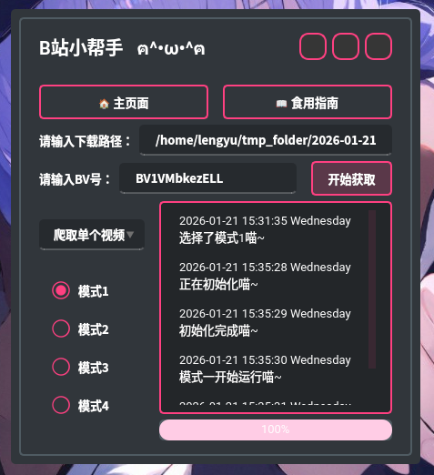

# 樱花雨 Sakura Rain

Coldrain 自制的多功能小工具箱 🧰



该工具箱基于 `Python` 实现，目前已基于 `PySide6` 制作出 GUI 界面，以供便捷的图形界面操作（有写终端界面的想法，但是由于时间有限，被鸽掉了 💦）

Sakura Rain 目前包含两种功能（后续会更新新功能）：
- 爬取 B 站视频
- 爬取樱花动漫网站上的番

> ⚠️ 由于樱花动漫网站音频文件处理方式一直在动态更改，樱花动漫相关功能不稳定，目前仍在测试中。

> 该项目继承于 Coldrain 的一个远古项目：[Bilibili Video Get](https://github.com/ziheng5/-bilibili-video-get-)

## 1. 安装依赖包 📦
该项目基于 `Python` 实现，食用前请先参照 `requirements.txt` 配置好 `Python` 环境：

```bash
pip install -r requirements
```

## 2. 安装 ffmpeg
此外，由于 B 站视频在爬取的时候是音频文件与画面文件分离的，所以如果需要将音频文件与画面文件合并为一个完整的视频文件，代码里调用了 ffmpeg，需要用户自行安装并配置环境变量：

### Windows ⬇️

参考 ffmpeg 官网：https://ffmpeg.org/download.html

### Linux ⬇️
Linux 下，可以前往官网下载，也可以使用包管理器进行下载，这里简单列举 `Ubuntu` 和 `Archlinux` 的例子：

#### Ubuntu
```bash
sudo apt install ffmpeg
```

#### Archlinux
```bash
sudo pacman -S ffmpeg
```

或使用 `aur`：

```bash
paru -S ffmpeg
```

### MacOS
（暂未尝试过，可以自己折腾折腾）


## 3. 运行程序
正常情况下，运行 `sakura_rain.py` 便可以直接食用了

## 4. 📦 打包为 `.exe`（for Windows 🪟）
当然，如果你是 `Windows` 操作系统，且想要将该项目打包为 `.exe` 文件的话，**直接**用 `Pyinstaller` 打包的话，会出现 `ffmpeg` 相关的问题。

解决方案：可以下载一个 `ffmpeg.exe`，将其移动到项目文件下，`Pyinstaller` 打包的时候将 `ffmpeg.exe` 一起打包进去。（由于项目已经年代久远，具体操作可以参考网络平台，作者当年就是这么解决的）

## 5. 关于番号查找
首先，访问网站：[樱花动漫](https://www.yhmb.cc/)

在该网站中搜素你想要看的番，比如《哭泣少女乐队》，对应的 `url` 为 https://www.yhmb.cc/v/456870/153，其中，456870/153 即为番号

> 为什么要这么麻烦？因为如果不采用番号的话，小生还要再写一个搜索、查找脚本，工作量有些大了（
